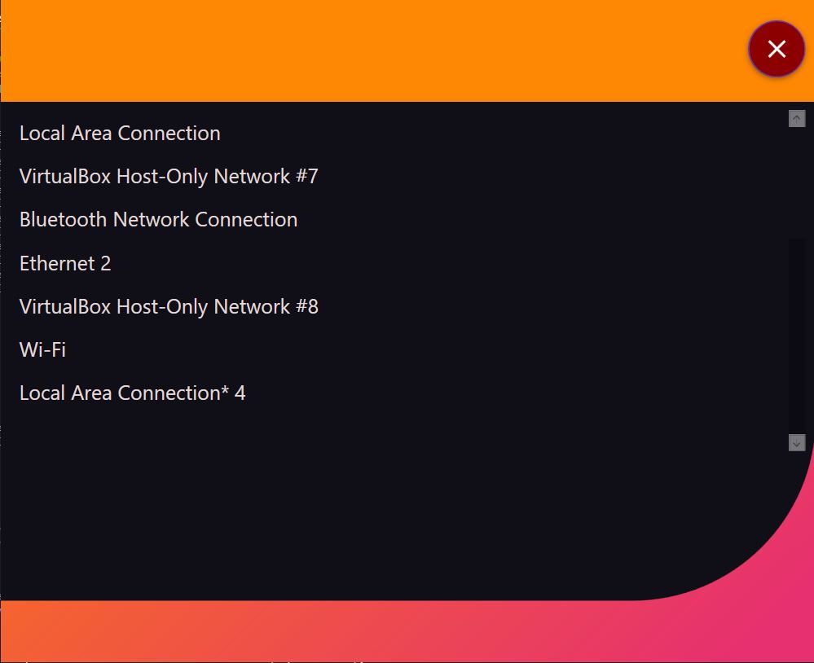

# NetworkMonitor
## Software Requirement for development
- Visual Studio 2019
- .NET
- WinPcap or Win10Pcap ( https://www.winpcap.org/install/ , http://www.win10pcap.org/ )

## Software Requirement for running application
- .NET ( Latest )
- WinPcap or Win10Pcap ( https://www.winpcap.org/install/ , http://www.win10pcap.org/ )

## Steps to Run
1. Run application "NetworkMonitor.exe"
2. Choose the network device from the list
3. To Start the capture - Click START
4. To Stop the capture - Click STOP

## Setup

